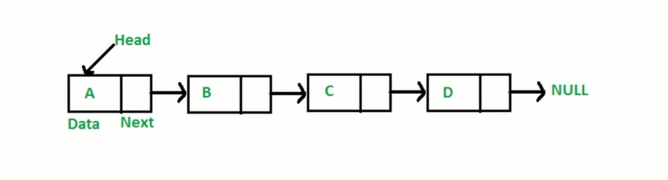
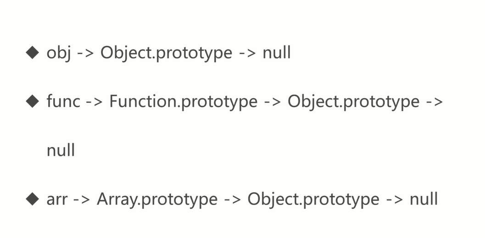

:::tip
学习了解链表的相关知识
:::

<!-- more -->

## 什么是链表

链表是多个元素组成的列表，元素存储不连续，用next指针连接在一起



## 数组和链表的区别

数组：增加或删除非首尾元素时候需要移动元素
链表：增删非首位元素，不需要移动元素，只需要更改next的指向即可

## js中的链表

js中是没有链表的，但是我们可以用object来模拟链表这种结构。

```js
const a = {val: 'a'}
const b = {val: 'b'}
const c = {val: 'c'}
const d = {val: 'd'}
a.next = b
b.next = c
c.next = d

// 遍历链表
let p = a
while(p){
  console.log(p.val) // a b c d
  p = p.next
}

// 插入值  将e插入cd之间
const e = {val: 'e'}
c.next = e
e.next = d

// 删除操作,删除e，改变next的指向即可
// 常规删除节点，找到被删除节点的上个节点（c），将上个节点(c)的next指向被删除节点的next(d)

c.next = d
```

## js中的原型链

- 原型链的本质是链表
- 原型链上的节点是各种原型对象 `Function.prototype` `Object.prototype`
- 原型链通过 `__proto__` 属性连接各种原型对象



instanceOf 原理

```js
const instanceOf = (A,B)=>{
  let p = A
  while(p){
    if(p === B.prototype){
      return true
    }
    p = p.__proto__
  }
  return false
}

instanceOf([],Array) // true
```

## 定义

链表节点定义

```js
 function ListNode(val) {
     this.val = val;
     this.next = null;
 }
```

## 例子

[删除链表中的节点](https://leetcode-cn.com/problems/delete-node-in-a-linked-list/)

请编写一个函数，使其可以删除某个链表中给定的（非末尾）节点。传入函数的唯一参数为 要被删除的节点 。

```js
// head = [4,5,1,9]
// node = 5
var deleteNode = function(node){
  node.val = node.next.val // [4,1,1,9]
  node.next = node.next.next // [4,1,9]
}

```

第一步：将删除节点的值赋值为删除节点的下一个值

第二部：将删除节点的next指向删除节点的下一个节点next(node.next.next)

**缺点** 删除的节点是非末尾节点

例子二：

[反转一个单链表](https://leetcode-cn.com/problems/reverse-linked-list)

给你单链表的头节点 head ，请你反转链表，并返回反转后的链表。

输入： head = [1,2,3,4,5]

```js

var reverseList = function(head){
  let p1 = head
  let p2 = null
  while(p1){
    const tmp = p1.next
    p1.next = p2
    p2 = p1
    p1 = tmp
  }
  return p2
}

```

例子三：

[两数相加](https://leetcode-cn.com/problems/add-two-numbers/)

给你两个 非空 的链表，表示两个非负的整数。它们每位数字都是按照 逆序 的方式存储的，并且每个节点只能存储 一位 数字。

请你将两个数相加，并以相同形式返回一个表示和的链表。

你可以假设除了数字 0 之外，这两个数都不会以 0 开头。

输入：l1 = [2,4,3], l2 = [5,6,4]

输出：[7,0,8]

解释：342 + 465 = 807

```js
var addTwoNumbers = function(l1,l2){
  const res = new ListNode(0)
  let part = 0
  let resp = res
  while(l1 || l2){
    let v1 = l1 ? l1.val : 0
    let v2 = l2 ? l2.val : 0

    let sum = v1+v2 + part
    if(l1){
      l1 = l1.next
    }
    if(l2){
      l2 = l2.next
    }
    resp.next = new ListNode(sum % 10)
    part = sum >= 10 ? 1 : 0
    resp = resp.next
  }
  if(part){
    resp.next = new ListNode(part)
  }
  return res.next
}
```

例子四:

[删除排序链表中的重复元素](https://leetcode-cn.com/problems/remove-duplicates-from-sorted-list/)

存在一个按升序排列的链表，给你这个链表的头节点 head ，请你删除所有重复的元素，使每个元素 只出现一次 。

返回同样按升序排列的结果链表。

注意：链表有序，重复元素一定是相邻的

输入：head = [1,1,2]

输出：[1,2]

```js
var deleteDuplicates = function(head){
  if(!head){
    return head
  }
  let p1 = head
  let p2 = head.next
  while(p2){
    if(p1.val === p2.val){
      p1.next = p2.next
      p2 = p1.next
    }else{
      p1 = p1.next
      p2 = p2.next
    }
  }
  return head
}

```

例子五：

[环形链表](https://leetcode-cn.com/problems/linked-list-cycle/)

给定一个链表，判断链表中是否有环。

如果链表中有某个节点，可以通过连续跟踪 next 指针再次到达，则链表中存在环。 为了表示给定链表中的环，我们使用整数 pos 来表示链表尾连接到链表中的位置（索引从 0 开始）。 如果 pos 是 -1，则在该链表中没有环。注意：pos 不作为参数进行传递，仅仅是为了标识链表的实际情况。

如果链表中存在环，则返回 true 。 否则，返回 false 。

```js
// 双指针，一快一慢,相逢则代表有环，否则没有环
var hasCycle = function(head) {
  if(!head){
    return false
  }
  let p1 = head
  let p2 = head.next
  while(p1 && p2 && p2.next){
    if(p2 === p1){ // 链表节点相同，则表明有环
      return true
    }
    if(!p1.next || !p2.next){ // next为空，则表明没有环
      return false
    }
    p1 = p1.next
    p2 = p2.next.next
  }
  return false
};
```
