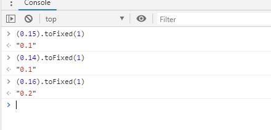

# js 中 toFixed 的bug

今天遇到了一个莫名奇妙的bug，公司测试大佬告诉我，页面上有个地方四舍五入值不对！

## (0.15).toFixed(1) !== "0.2"
是的， 讲道理  (0.15).toFixed(1) 应该是等于 0.2 的，可是结果就是0.1，感觉到不可思议，控制台运行一遍看下


果然如此！！！开了眼界

## 解决方式

- 重写Number原型上的toFixed 方法

```js
Number.prototype.toFixed = function (d) {
  var s = this + "";
  if (!d) d = 0;
  if (s.indexOf(".") == -1) s += ".";
  s += new Array(d + 1).join("0");
  if (new RegExp("^(-|\\+)?(\\d+(\\.\\d{0," + (d + 1) + "})?)\\d*$").test(s)) {
    var s = "0" + RegExp.$2, pm = RegExp.$1, a = RegExp.$3.length, b = true;
    if (a == d + 2) {
      a = s.match(/\d/g);
      if (parseInt(a[a.length - 1]) > 4) {
        for (var i = a.length - 2; i >= 0; i--) {
          a[i] = parseInt(a[i]) + 1;
          if (a[i] == 10) {
            a[i] = 0;
            b = i != 1;
          } else break;
        }
      }
      s = a.join("").replace(new RegExp("(\\d+)(\\d{" + d + "})\\d$"), "$1.$2");
    } if (b) s = s.substr(1);
    return (pm + s).replace(/\.$/, "");
  } return this + "";
};
```
参考 [重写toFixed](https://blog.csdn.net/nndhyp/article/details/78614480)

- 借助Math.round

```js
// 保留一位小数
Math.round(0.15 * 10) / 10 //0.2
// 保留两位小数
Math.round(0.15 * 100) / 100 //0.15

function toFixed(num,n){
    const base = Math.pow(10,n)
    return Math.round(num * base) / base
}
toFixed(0.15,1) // 0.2
toFixed(0.15,2) // 0.15
```

