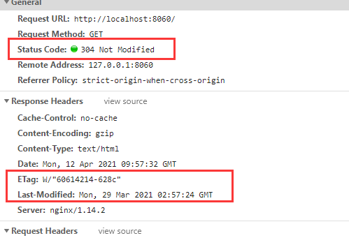

:::tip
缓存，我的绕不过去的痛！我们一般分为协商缓存和强缓存两种。协商缓存，就是需要和服务器进行协商，最终确定是否使用本地缓存！
:::

<!-- more -->

下面记录下我的对于缓存的理解

## 两种缓存的问题点

### 强缓存

强缓存主要通过设置 http 请求头的 Cache-Control 和 Expire 两个字段控制。重点考虑 Cache-Control 这个字段。
一般我们会设置 Cache-Control 的值为 “public, max-age=xxx”，表示在xxx秒内再次访问该资源，均使用本地的缓存，不再向服务器发起请求。但是如果在这个时间，服务器上面的资源已经更新了，但是客户端得到的内容还是之前的，这怎么办？

expire 的值是设置时间，因此，要求服务端时间和客户端时间完全一致。

### 协商缓存
协商缓存常用的字段有ETag,Last-Modified
协商缓存最大的问题就是每次都要向服务器验证以下缓存的有效性，也就是说，任何资源，你都要问一下服务器这个资源还有效不？

## 最佳实践

缓存的意义在于减少请求，更多的使用本地的资源，减轻服务端的压力，给用户更好的体验。因此，我们尽可能的命中强缓存，同时，能在更新的时候让客户端的缓存失效。
在前端spa开发盛行的今天，伟大的webpack可以在给项目打包的时候，加上hash值。因此，每次文件有修改都能有不同的hash值。

综上所述：
- HTML: 使用协商缓存
- CSS&JS&图片： 使用强缓存，文件命名带上hash值。

## 浏览器缓存

当我们的服务端没有设置缓存时，浏览器发起第二次请求，可以在控制面板看到一些请求显示 `200 OK (from disk cache)`或`200 OK (from memory cache)`,浏览器并没有发出请求，直接
从磁盘或者内存中取到了资源。


## ETag 计算

Nginx 官方默认的ETag 计算方式是"文件最后修改时间16进制-文件长度16进制"。
> 例： ETag: W/"606dd746-3a06e"

## Nginx 如何配置呢

符简单例子：

```conf
# 设置一些静态资源的图片视频的缓存时间为7天,设置强缓存
location ~ .*\.(?:jpg|jpeg|gif|png|ico|cur|gz|svg|svgz|mp4|ogg|ogv|webm)$ {
  expires max;
  add_header cache-control max-age;
}

# 在对应的location中增加以下代码，即html后缀的文件名不会进行缓存,当然也可以进行协商缓存，参考各个大厂的做法，不缓存，因为 index.html文件一般来说是相当小的1kb
if ($request_filename ~* \.(htm|html)$) {
  add_header  Cache-Control  no-store;
}

# 当然也可以是协商缓存
# 服务端状态码返回304 (304 Not Modified) 见 下图
if ($request_filename ~* \.(htm|html)$) {
  add_header Cache-Control no-cache;
}
```


no-cache表示不缓存过期资源，缓存会向服务器进行有效处理确认之后处理资源

而no-store才是真正的不进行缓存。