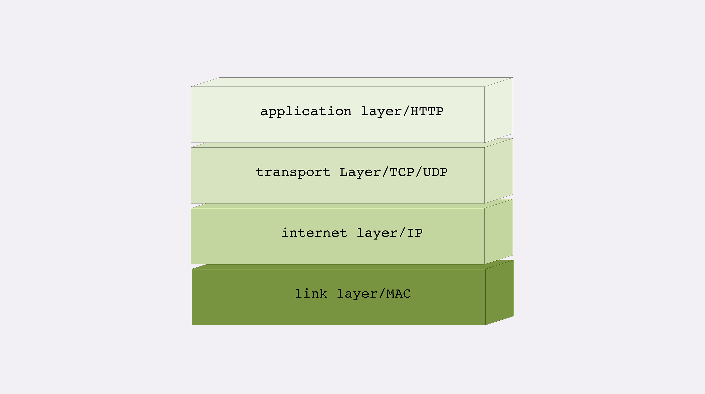
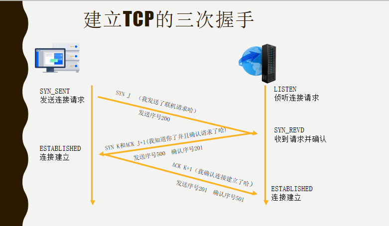

在浏览器里，从输入 URL 到页面展示，这中间发生了什么，这是亿到经典的面试题，能比较全面地考察应聘者只是的掌握程度，其中设涉及了网络、操作系统、Web等一系列的知识。

## 用户输入

用户输入查询关键字后，地址栏会判断输入的关键字是搜索内容还是请求的 URL。

- 如果是搜索内容，地址栏会使用浏览器默认的搜索引擎，来合成带关键字的 URL。
- 如果输入内容符合 URL 规则，地址栏会根据规则，把内容加上协议，合成完整的 URL。

## 网络请求

接下来，便进入了页面资源请求过程。这时，浏览器进程会通过进程间通信（IPC）把 URL 请求发送至网络进程，网络进程接收到 URL 请求后，会在这里发起真正的 URL 请求流程。
首先，网络进程会查找本地缓存是否缓存资源。如果存在缓存资源。

### 1. 浏览器缓存

首先先说一下两个概念，强缓存和协商缓存。

#### 服务端缓存控制

强缓存与服务端的缓存控制息息相关，启用强缓存有以下几种情况。

- 存在 Cache-Control 属性，设置 max-age 属性值并且不存在 no-cache 和 no-store
- 不存在 Cache-Control 属性，存在 Expires 字段

#### 客户端缓存控制

> 进入协商缓存之前还需要经过 DNS 解析、建立 TCP/IP 连接，如果是 https 协议还需要建立 TLS 连接。

协商缓存由客户端发起（条件请求），如果没有命中强缓存，就会进入协商缓存阶段。
条件请求一共有 5 个头字段，我们最常用的就是“if-Modified-Since”和“If-None-Match”这两个。
使用的前提是需要第一次的响应报文预先提供“Last-modified”和“ETag”，然后第二次请求就可以带上缓存里的原值，验证资源是否是最新的。

### 2. DNS 解析

上面说到浏览器缓存，首先，网络进程会查找本地缓存是否缓存资源。
如果存在缓存资源，就直接返回资源给浏览器进程。如果不存在缓存，这时就要判断是否需要 DNS 解析。
首先判断 URI 是否是一个域名，如果是一个域名，走 DNS 解析流程，获取服务器的 IP 地址。

#### DNS 系统

- 根域名服务器（Root DNS Server）：管理顶级域名服务器，返回“com”“net”“cn”等顶级域名服务器的 IP 地址；
- 顶级域名服务器（Top-level DNS Server）：管理各自域名下的权威域名服务器，比如 com 顶级域名服务器可以返回 apple.com 域名服务器的 IP 地址；
- 权威域名服务器（Authoritative DNS Server）：管理自己域名下主机的 IP 地址，比如 apple.com 权威域名服务器可以返回 www.apple.com 的 IP 地址；

DNS 的解析流程。

浏览器缓存 -> 操作系统缓存 -> 本地 hosts 文件 -> 非权威域名服务器 -> 根域名服务器 -> 顶级域名服务器 -> 权威域名服务器。

### 3. 建立 TCP/IP 连接

获取到服务器的 IP 地址后，就可以建立 TCP/IP 连接了。

#### 网络分层模型

述建立 TCP/IP 连接之前，我们先来了解一下 TCP/IP 网络分层模型。

TCP/IP 协议总共有四层，它的层次顺序是“从下往上”数的，第一层是最下面的一层。
第一层叫“链接层”（link layer），负责在以太网、WiFi 这样的的底层数据上发送原始数据包，工作在网卡这个层次，使用 MAC 地址来标记网络上的设备，所以有时候也叫 MAC 层。
第二层叫“网际层”或者“网络互连层”（internet layer），IP 协议就处在这一层。
第三层叫“传输层”（transport layer），这个层次协议的职责是保证数据在 IP 地址标记的两点之间“可靠”地传输。TCP 协议就位于这一层，另外还有 UDP 也位于这一层。
第四层叫“应用层”（application layer）。这一层有各种面向具体应用的协议。例如 Telnet、SSH、FTP、SMTP 等。当然还有最常见的 HTTP 协议。

#### 三次握手

首先你需要了解以下概念。

- ACK：Acknowledement 确认字符
- SYN：Synchronize Sequence Numbers 同步序列编号

其次你还需要知道这几种状态。

- LISTEN：监听 TCP 端口的连接请求（等待对方发送连接请求）
- SYN-SENT：发送连接请求后等待匹配的连接请求（已发送请求，等待回复）
- SYN-RECEIVED：收到和发送一个连接请求等待对连接请求确认（收到连接请求，等待回复）
- ESTABLISHED：已经打开的连接（已经建立连接，可以发送数据）

下面是三次握手的示意图。

TCP/IP 三次握手整个流程，总结如下：

第一次握手：客户端向服务器发送 SYN 标志位（序号是J），并且进入 SYN_SEND 状态（等待服务器确认状态）。
第二次握手：服务器收到客户端的 SYN J 后，服务端会确认改数据包已收到并发送 ACK 标志位（序号是J+1）和 SYN 标志位（序号是K），服务器进入 SYN_RECV 状态（请求接收并等待客户端确认状态）。
第三次握手：客户端进入连接建立状态，向服务端发送 ACK 标志位（序号是K+1），确认客户端已收到建立连接确认，服务端收到 ACK 位后，服务端进入连接已建立状态。

在 HTTP 协议里，建立 TCP/IP 连接后，浏览器会立即发送请求报文。

### 4. 建立 TLS 连接

建立 TCP/IP 连接后，如果发现请求协议是 HTTPS，还需要建立 TLS 连接。 这个“握手过程”与 TCP 类似，是 HTTPS 和 TLS 协议里最重要、最核心的部分。

### 5. HTTP 代理

建立 TCP/IP 连接或 TLS 连接后，就可以发起 HTTP 数据请求了。
不过数据请求的过程中还可能存在一个或者多个中间人，有可能请求并不会直接到达源服务器。
代理服务器处理 HTTP 通信过程中的中间位置，对上屏蔽了真实客户端，对下屏蔽了真实服务器。
在这个中间层可以做很多的事情，为 HTTP 协议增加了更多的灵活性。
代理的一个常见的功能就是负载均衡，可以掌握请求分发的“大权”，决定由后面的哪台服务器响应请求。
代理中存在一些常用的负载均衡算法，比如轮询、一致性哈希等，这些算法的目的就是尽量把外部流量合理地分散到多台源服务器，提高系统的整体资源利用率和性能。

### 处理响应数据

HTTP 请求的数据类型，可能是一个下载类型，也可能是 HTML 页面，浏览器是如何区分它们的？
答案是 Content-Type。Content-Type 是 HTTP 头中一个非常重要的字段， 它告诉浏览器服务器返回的响应体数据是什么类型，然后浏览器会根据 Content-Type 的值来决定如何显示响应体的内容。
需要注意的是，如果服务器配置 Content-Type 不正确，比如将 text/html 类型配置成 application/octet-stream 类型，那么浏览器可能会曲解文件内容，比如会将一个本来是用来展示的页面，变成了一个下载文件。
所以，不同 Content-Type 的后续处理流程也截然不同。
如果 Content-Type 字段的值被浏览器判断为下载类型，那么该请求会被提交给浏览器的下载管理器，同时该 URL 请求的导航流程就此结束。
但如果是 HTML，那么浏览器则会继续进行导航流程。由于 Chrome 的页面渲染是运行在渲染进程中的，所以接下来就需要准备渲染进程了。

### 准备渲染进程

渲染进程准备好之后，还不能立即进入文档解析状态，因为此时的文档数据还在网络进程中，并没有提交给渲染进程，所以下一步就进入了提交文档阶段。

### 提交文档

所谓提交文档，就是指浏览器进程将网络进程接收到的 HTML 数据提交给渲染进程，具体流程是这样的：

- 首先当浏览器进程接收到网络进程的响应头数据之后，便向渲染进程发起“提交文档”的消息；
- 渲染进程接收到“提交文档”的消息后，会和网络进程建立传输数据的“管道”；
- 等文档数据传输完成之后，渲染进程会返回“确认提交”的消息给浏览器进程；
- 浏览器进程在收到“确认提交”的消息后，会更新浏览器界面状态，包括了安全状态、地址栏的 URL、前进后退的历史状态，并更新 Web 页面；

到这里，一个完整的导航流程就“走”完了，这之后就要进入渲染阶段了。

### 六、渲染阶段

构建 DOM 树 -> 构建 CSSOM 树 -> 计算出 DOM 树中每个节点的具体样式 -> 创建布局树 -> 布局计算 -> 分层 -> 图层绘制 -> 合成与显示