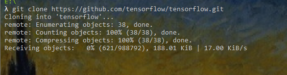
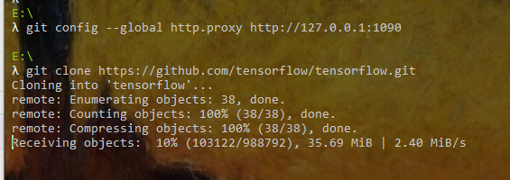
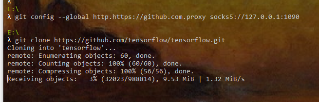

:::tip
由于众所周知的原因，在国内，clone一个github上的代码仓库，总是很慢
:::

<!-- more -->

## 前置条件

1. 前提是你本地有相关代理。

## 方式1

```bash
git config --global http.proxy http://127.0.0.1:1080
```

**注意，后面的端口号请更换为你本地代理的端口号**
设置好后，测试了一下，见图





上图为设置前，下图为设置后，可以看到，设置后的速度达到2.4m/s，是设置前的接近150倍，速度提升明显

如果我们需要取消上面的配置

```bash
git config --global --unset http.proxy
```

## 方式2

代理到socks5

```bash
git config --global http.proxy socks5://127.0.0.1:1080
```

一样，后面的端口号也是你本地代理的端口号

测试结果如下图



速度也还是可以的

取消代理

```bash
git config --global --unset http.proxy
```

## 仅设置github的代理

http方式

```bash
#只对github.com
git config --global http.https://github.com.proxy http://127.0.0.1:1080

#取消代理
git config --global --unset http.https://github.com.proxy
```

socks5方式

```bash
#只对github.com
git config --global http.https://github.com.proxy socks5://127.0.0.1:1080

#取消代理
git config --global --unset http.https://github.com.proxy
```
