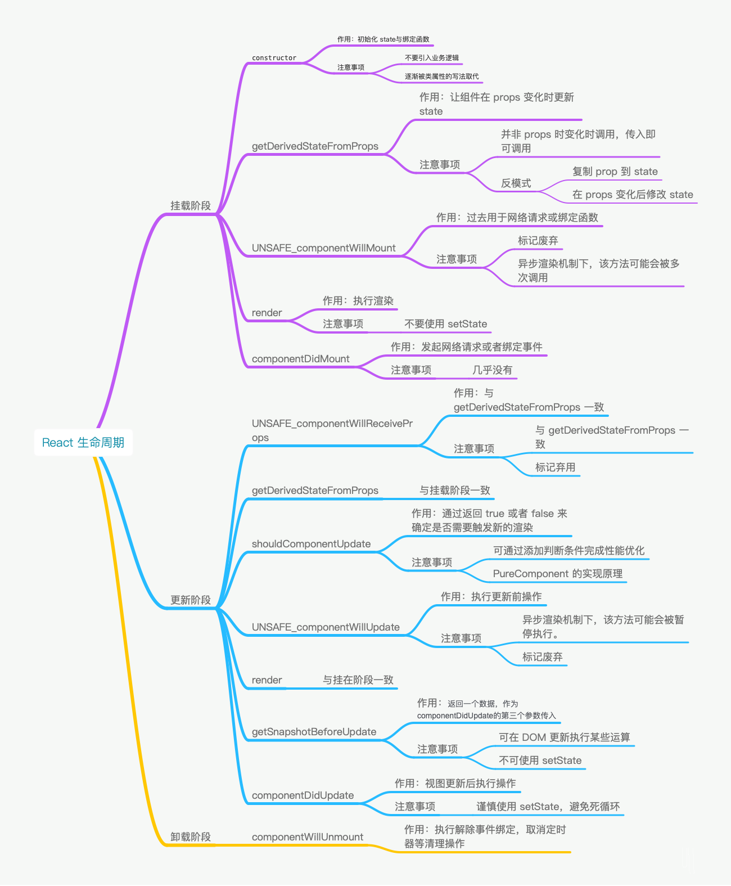

## 生命周期

当我们在讨论生命周期的时候，我们一般是在讨论类组件，函数式组件没有生命周期的概念，因为本身是一个函数，只会从头执行到尾。
react 中的生命周期主要是从三个阶段来区分，分别是挂载阶段，更新阶段，卸载阶段

## 挂载阶段

挂载阶段是指组件从初始化到完成加载的过程

### constructor

`constructor`是类通用的构造函数，常用于初始化，`constructor` 通常用于初始化state 与绑定函数

```js
import React from 'react'

class Counter extends React.Component {
  constructor(props) {
    super(props)
    this.state = {
      count: 0,
    }
    this.handleClick = this.handleClick.bind(this)
  }

  handleClick() {
     // do some stuff
  }

  render() {
     return null
  }
}
```

但是现在类属性的开始流行，一般就去除了`constructor`

```js
import React from 'react'
class Counter extends React.Component {
   state = {
      count: 0,
   }
   // 类属性第三阶段提案
   handleClick = () => {
     // do some stuff
   }
  render() {
     return null
  }
```

### getDerivedStateFromProps

该函数的作用是使组件的在props变化时更新state,他的触发时机是：

- 当props被传入时
- state 发生变化时
- forceUpdate被调用时

```js
class ExampleComponent extends React.Component {
  // 在构造函数中初始化 state，
  // 或者使用属性初始化器。
  state = {
    isScrollingDown: false,
    lastRow: null,
  };
  static getDerivedStateFromProps(props, state) {
    if (props.currentRow !== state.lastRow) {
      return {
        isScrollingDown: props.currentRow > state.lastRow,
        lastRow: props.currentRow,
      };
    }
    // 返回 null 表示无需更新 state。
    return null;
  }
}

```

### UNSAFE_componentWillMount

已经弃用，因为`componentWillMount`因为在 React 的异步渲染机制下，该方法可能会被多次调用。

### render

render函数返回jsx结构，用于描述具体的渲染内容，render函数是一个纯函数，不应该在里面产生副作用，比如调用 setState，否则会造成死循环。

### componentDidMount

用于组件加载完成时做某些操作，比如发起网络请求，比如绑定事件。该函数是接着 render 之后调用的。但 componentDidMount 一定是在真实 DOM 绘制完成之后调用吗？在浏览器端，我们可以这么认为。

但在其他场景下，尤其是 React Native 场景下，componentDidMount 并不意味着真实的界面已绘制完毕。由于机器的性能所限，视图可能还在绘制中。

## 更新阶段

更新阶段是指外部 props 传入，或者 state 发生变化时的阶段。

### UNSAFE_componentWillReceiveProps

弃用，因为其功能可被函数 getDerivedStateFromProps 所替代。
另外，当 getDerivedStateFromProps 存在时，UNSAFE_componentWillReceiveProps 不会被调用

### getDerivedStateFromProps(更新阶段)

同挂载阶段的表现一致。

### shouldComponentUpdate

该方法通过返回 true 或者 false 来确定是否需要触发新的渲染。因为渲染触发最后一道关卡，所以也是性能优化的必争之地。通过添加判断条件来阻止不必要的渲染。
React 官方提供了一个通用的优化方案，也就是 PureComponent。PureComponent 的核心原理就是默认实现了shouldComponentUpdate函数，在这个函数中对 props 和 state 进行浅比较，用来判断是否触发更新。

```js
shouldComponentUpdate(nextProps, nextState) {
  // 浅比较仅比较值与引用，并不会对 Object 中的每一项值进行比较
  if (shadowEqual(nextProps, this.props) || shadowEqual(nextState, this.state) ) {
    return true
  }
  return false
}

```

### UNSAFE_componentWillUpdate

同样已废弃，因为后续的 React 异步渲染设计中，可能会出现组件暂停更新渲染的情况。

### render(更新阶段)

同挂载阶段一致

### getSnapshotBeforeUpdate

getSnapshotBeforeUpdate 方法是配合 React 新的异步渲染的机制，在 DOM 更新发生前被调用，返回值将作为 componentDidUpdate 的第三个参数。

```js
class ScrollingList extends React.Component {
  constructor(props) {
    super(props);
    this.listRef = React.createRef();
  }
  getSnapshotBeforeUpdate(prevProps, prevState) {
    // Are we adding new items to the list?
    // Capture the scroll position so we can adjust scroll later.
    if (prevProps.list.length < this.props.list.length) {
      const list = this.listRef.current;
      return list.scrollHeight - list.scrollTop;
    }
    return null;
  }
  componentDidUpdate(prevProps, prevState, snapshot) {
    // If we have a snapshot value, we've just added new items.
    // Adjust scroll so these new items don't push the old ones out of view.
    // (snapshot here is the value returned from getSnapshotBeforeUpdate)
    if (snapshot !== null) {
      const list = this.listRef.current;
      list.scrollTop = list.scrollHeight - snapshot;
    }
  }
  render() {
    return (
      <div ref={this.listRef}>{/* ...contents... */}</div>
    );
  }
```

### componentDidUpdate

正如上面的案例，getSnapshotBeforeUpdate 的返回值会作为componentDidUpdate的第三个参数使用。

## 卸载阶段

卸载阶段就容易很多了，只有一个回调函数。

### componentWillUnmount

该函数主要用于执行清理工作。一个比较常见的 Bug 就是忘记在 componentWillUnmount 中取消定时器，导致定时操作依然在组件销毁后不停地执行。所以一定要在该阶段解除事件绑定，取消定时器。

## 小结

依照上面的梳理，整理出下面的知识导图。



## 职责梳理

在整个生命周期之后，需要强调两个事情

- 什么情况下会触发重新渲染
- 渲染发生报错后会怎样？又该如何处理？

### 函数组件

**函数组件任何情况下都会重新渲染**，他并没有生命周期，官方提供了优化手段  React.memo

`React.memo`并不是阻断渲染，而是跳过渲染租价的操作，并直接复用最近一次的渲染的结果，和 `shouldComponentUpdate`是不同的。

### React.component

如果不实现 shouldComponentUpdate 函数，那么有两种情况触发重新渲染。

- 当 state 发生变化时。
- 当父级组件的 Props 传入时。无论 Props 有没有变化，只要传入就会引发重新渲染。

### React.PureComponent

PureComponent 默认实现了 `shouldComponentUpdate` 函数。所以仅在 props 与 state 进行浅比较后，确认有变更时才会触发重新渲染。

### 错误边界

错误边界是一种 React 组件，这种组件可以捕获并打印发生在其子组件树任何位置的 JavaScript 错误，并且，它会渲染出备用 UI，如下 React 官方所给的示例：

```js
class ErrorBoundary extends React.Component {
  constructor(props) {
    super(props);
    this.state = { hasError: false };
  }
  static getDerivedStateFromError(error) {
    // 更新 state 使下一次渲染能够显示降级后的 UI
    return { hasError: true };
  }
  componentDidCatch(error, errorInfo) {
    // 你同样可以将错误日志上报给服务器
    logErrorToMyService(error, errorInfo);
  }
  render() {
    if (this.state.hasError) {
      // 你可以自定义降级后的 UI 并渲染
      return <h1>Something went wrong.</h1>;
    }
    return this.props.children; 
  }
}

```
