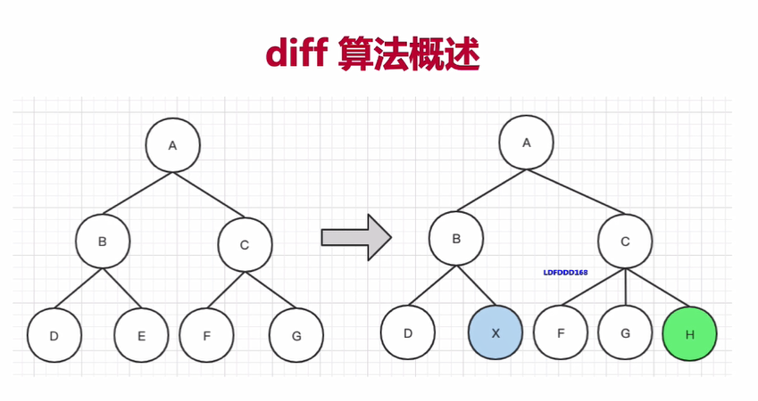
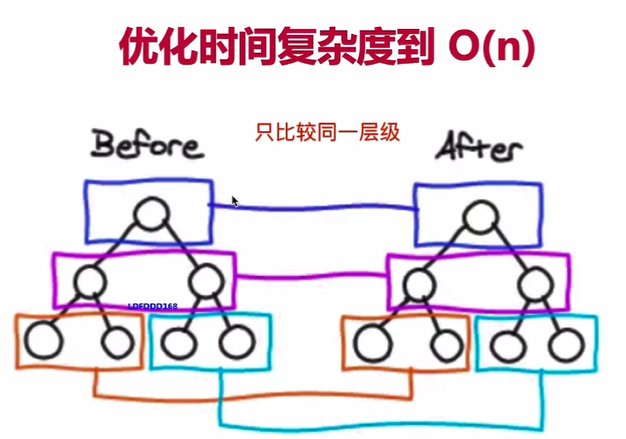

:::tip
用了这么久的 Vue 了，还不知道 vdom知识？
:::
<!-- more -->

## 背景

因为dom操作会比较耗时，一个复杂的应用大量的dom操作，首先会引发性能问题，然后大量的dom操作，会导致程序难以维护，数据驱动视图的方式此时登场！

- 项目具有一定的复杂度，dom操作难以维护
- js计算执行速度快

## vdom

vdom 首先是react带来了，vue在2.0版本中引进了，vdom就是先用js来模拟数据结构，计算出最小的变更，然后再操作dom，更新视图。

## 用js模拟dom结构

```vue
<div id="div1" class="container">
  <p>vdom</p>
  <ul style="font-size: 20px">
    <li>hello</li>
  </ul>
</div>
```
以上dom节点片段，我们怎么用js来模拟呢，见下：
```js
{
  tag: 'div',
  props:{
    className: 'container',
    id: 'div1'
  },
  children:[
    {
      tag: 'p',
      children: 'vdom'
    },
    {
      tag: 'ul',
      props: {
        style: 'font-size: 20px'
      },
      children: [
        {
          tag: 'li',
          children: 'hello'
        }
      ]
    }
  ]
}
```

## 通过snabbdom学习vdom

- 简介强大的vdom库，易学易用
- Vue参考他实现vdom 和 diff
- [地址](https://github.com/snabbdom/snabbdom)

## diff算法

diff 算法是vdom中最核心最关键的部分

### 概述

- diff 算法，并不是vdom独创的，diff即对比，是一个广泛的概念，如linux diff命令，git diff等
- 两个js对象也可以做diff,如 [jsdiff](https://github.com/cujojs/jiff)
- 两棵树可以做diff，也就是 vdom diff



树的diff算法时间复杂度是 O(n^3),
- 第一，遍历 tree1,第二，遍历tree2
- 第三，排序
- 1000个节点，要计算1亿次，算法不可用

因此，需要优化时间复杂度

解决方式：
- 只比较同一层级，不跨级比较
- tag不相同，则直接删掉重建，不再深度比较
- tag 和 key，两者都相同，则认为是相同的节点，不再深度比较

 

 


